### These steps will be followed for the experiment
<!-- **PRE EXPERIMENT TASK**
 
1) What is distributed system? 
2) What is discrete system? 
3) What is degree of freedom? 
4) What is the mathematical formula for mode shapes in a supported
plate? 
5) What is the mathematical formula for natural frequency in a supported

plate?  -->

**Preparation of specimens:**

1. Click start experiment button to start the experiment.

2. Select all the parameters.

3. Enter details for Specimen 1.

4. Enter details for Specimen 1.

5. Enter details for Specimen 1.

Click calculate button to show calculated frequency with animated graph.

6. Select all the parameters.

7. Enter details for Specimen 2.

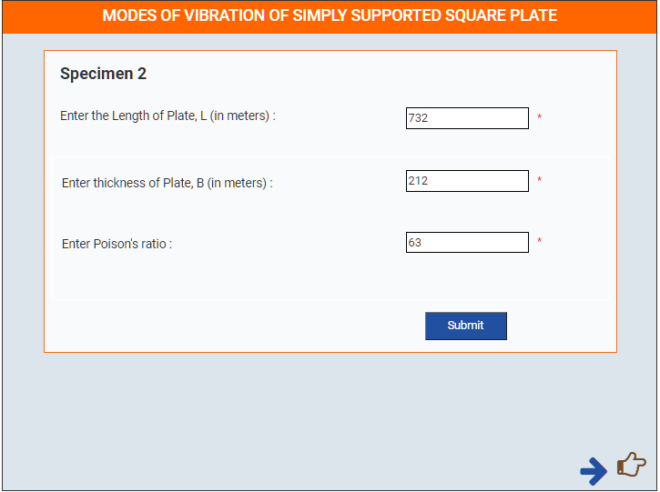

8. Enter details for Specimen 2.

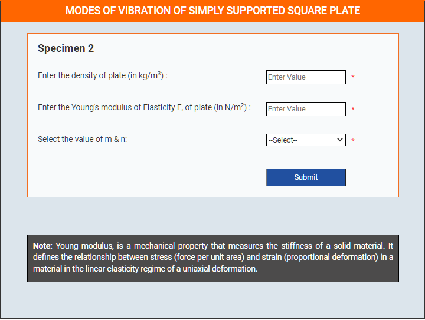

9. Enter details for Specimen 2.

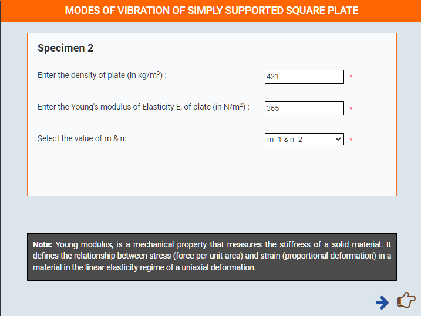

Click calculate button to show calculated frequency with animated graph.

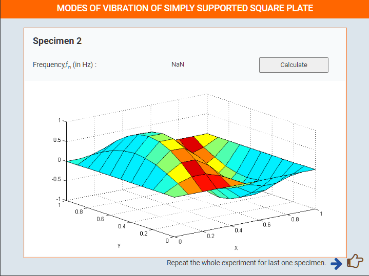

10. Select all the parameters.

11. Enter details for Specimen 3.

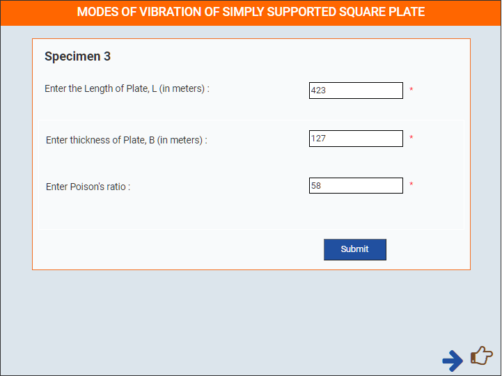

12. Enter details for Specimen 3.

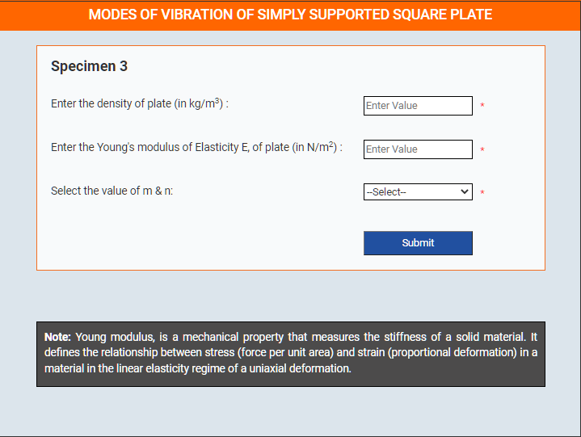

13. Enter details for Specimen 3.

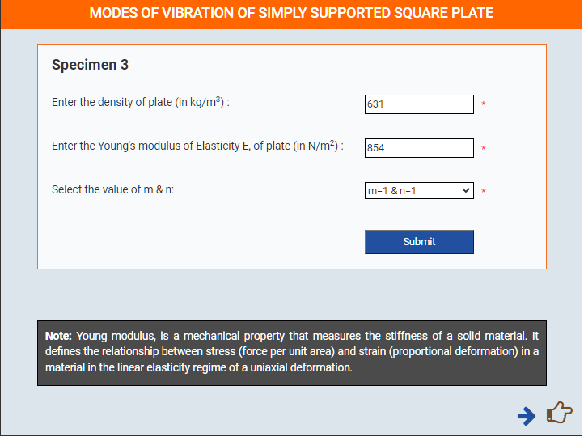

Click calculate button to show calculated frequency with animated graph.

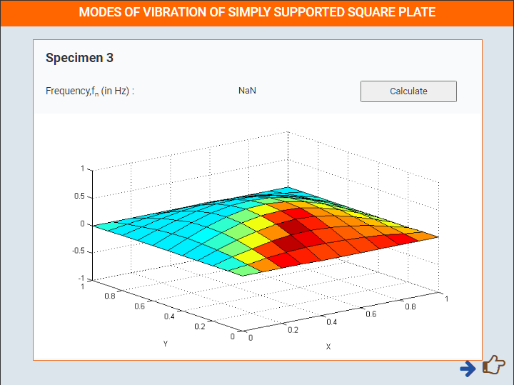

Plot graph between Elasticity & Calculated Frequency.

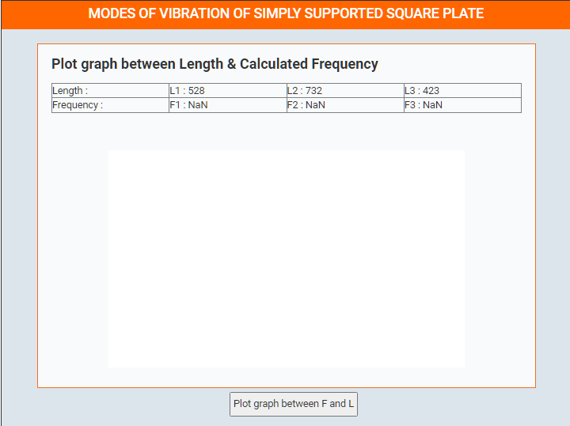

Graph

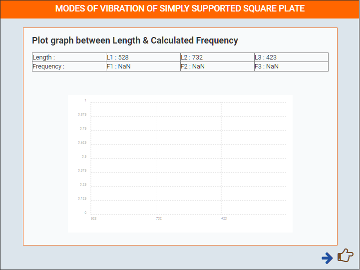

Plot graph between Elasticity & Calculated Frequency.

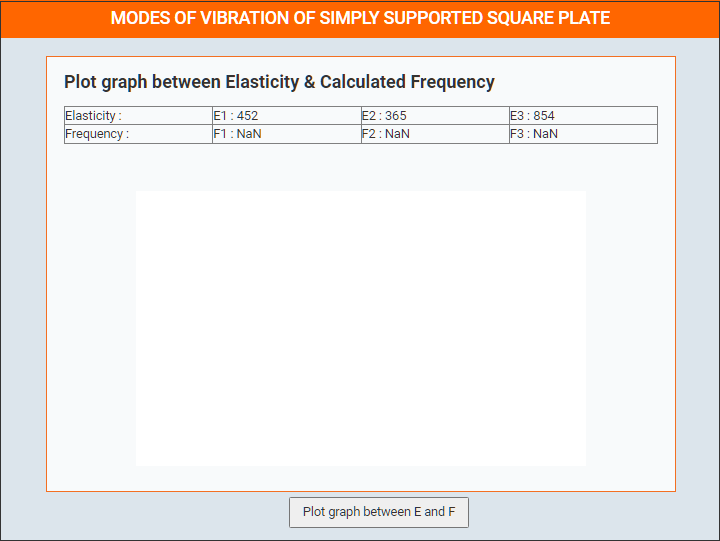

Graph
Thank You for performing Experiment, to repeat experiment click Restart button.
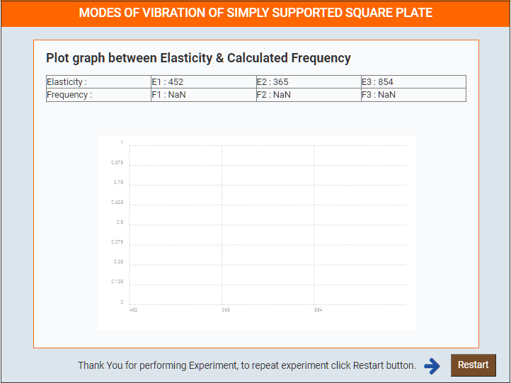

 

<!-- 
**POST EXPERIMENT TASK**
 
1) Compute frequency for five different lengths of the plate, keeping all
other parameter constant. Plot a graph between frequency and length. 
2) Calculate the natural frequencies of plate and simulate the first five
modes shapes.  -->
