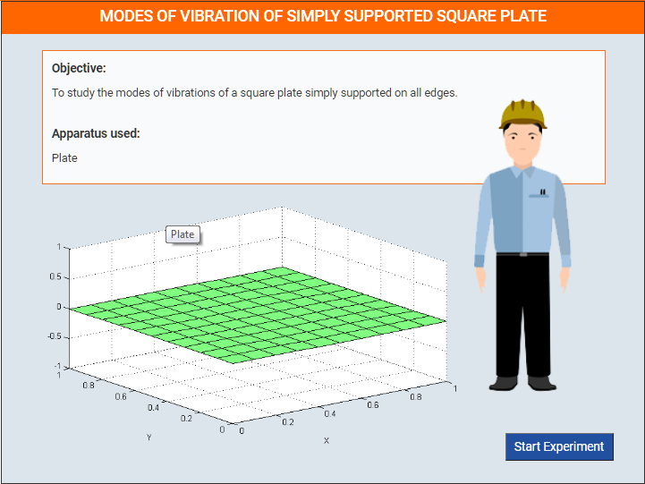
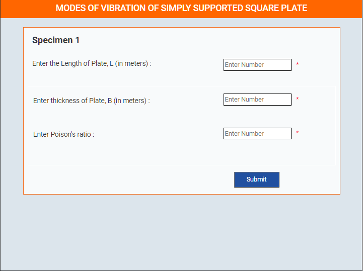
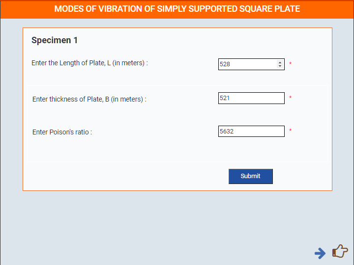
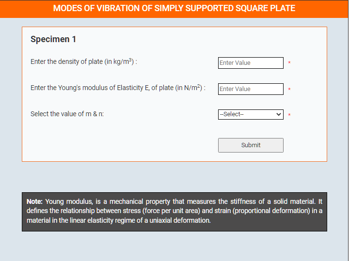
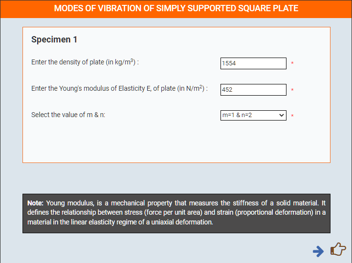
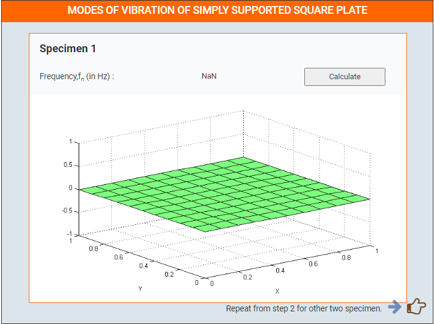
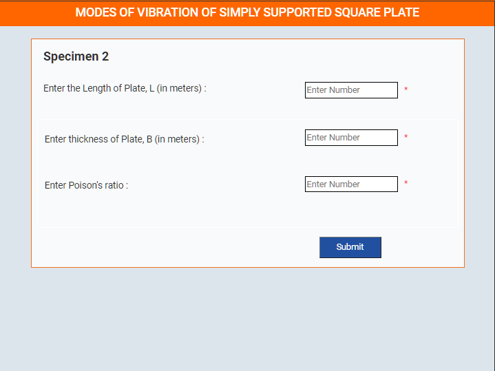

### These steps will be followed for the experiment
**PRE EXPRIMENT QUIZ QUESTIONS**
 
1) What is distributed system? 
2) What is discrete system? 
3) What is degree of freedom? 
4) What is the mathematical formula for mode shapes in a supported
plate? 
5) What is the mathematical formula for natural frequency in a supported
plate? 

**Preparation of specimens:**

1. Click Start Here button to start the experiment.

2. Select all the parameters.

3. Enter details for Specimen 1.

4. Click Calculate button to show Calculated frequency with animated graph.

5. Repeat the same process for specimen 2 and specimen 3.
 
6. Plot Graph Between Length & Calculated Frequenty.

7. Plot Graph Between Elasticity & Calculated Frequenty.

8. Click Restart button to perform experiment again.

 

**POST EXPRIMENT QUIZ QUESTIONS**
 
1) Compute frequency for five different lengths of the plate, keeping all
other parameter constant. Plot a graph between frequency and length. 
2) Calculate the natural frequencies of plate and simulate the first five
modes shapes. 
