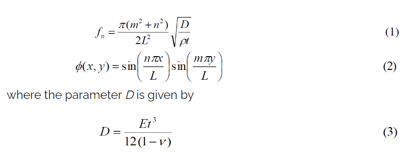

### Theory

This simulation experiment aims to study the modes of vibrations of square plate simply supported on all edges. This plate is different from a discrete system, where the stiffness, mass and damping are modelled as discrete properties. The alternative continuous method of modelling physical system, which is considered here, is based on the principle of distributed mass and stiffness characteristics. Such a system is considered to be composed of an infinite number of infinitesimal particles. Theoretically, such a system possesses an infinite number of degrees of freedom (DOF). However, only the first few modes are much significant. It is thus not necessary to study all of them.

The distributed systems are considered. Theoretically, they possess an infinite number of degrees of freedom (DOF). Only the first few modes are much significant. It is thus not necessary to study all of them.

The computational model of a square plate simply supported on all edges is based on continuous system approach. By using this online simulation, the student/user can easily determine the natural frequencies of plate as well as the corresponding mode shapes. In addition, there is an exercise for user. The user can study and plot a graph between the natural frequency and the length of the plate keeping all others factors constant. Similarly, relation between the natural frequency and the Young’s modulus of elasticity can be studied.

For this plate, the frequencies fn and the mode shapes Φ(x,y) are given by (Mukhopadhyay, 2006)

<i>n</i> and <i>m</i> are number of troughs/ crests in x and y directions respectively. Further, <i>L</i> is the length of plate, <i>E</i> is the Young's modulus of elasticity, <i>ρ</i> is the density, <i>t</i> is the thickness of the plate and &#957; is the Poisson's ratio.

User can get different modes of vibration of this plate from this program, just in single click.
